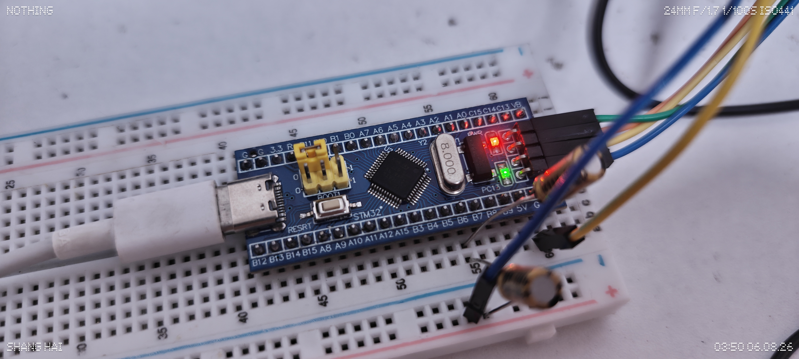

# NanoFM

A fully fixed-point 2-operator FM synthesizer running on the STM32F103, with USB MIDI input and PWM audio output.\
NanoFM 是一个运行在 STM32F103 上的全定点 2OP FM 合成器，支持 USB MIDI 输入，并通过 PWM 输出音频。

## It features / 它拥有

- Fixed-point 2-operator synthesis core / 全定点 2OP 合成核心
- FM, feedback FM, and additive algorithms / 支持 FM、带反馈 FM 和加法算法
- 40 kHz sample rate with double-buffered DMA / 40 kHz 采样率，双缓冲 DMA 输出
- USB MIDI support for notes, CCs, and program changes / 支持 USB MIDI 音符、CC 和音色切换
- Built-in patch bank with 8 simple patchs / 内置 8 个预设简单音色
- ADSR envelopes, waveform selection, pitch offsets, and frequency LFO / 支持 ADSR、波形选择、音高偏移和频率 LFO

## CC controls / CC 控制表

All CC values are standard 0-127 MIDI values.\
所有 CC 的输入值都是标准 MIDI 0-127

### Global / 全局

| CC | Parameter | 参数 | Range / 范围 |
| --- | --- | --- | --- |
| 7 | Channel Volume | 通道音量 | 0-127 |
| 14 | Algorithm | 算法 | 0-42: FM, 43-85: Feedback FM, 86-127: Additive |
| 15 | Mod Index | 调制深度 | 0-524288 |
| 16 | Feedback | 反馈量 | 0-7 |

### Operators / 算子

OP0 uses CC 20-29, OP1 uses CC 40-49.\
OP0 使用 CC 20-29，OP1 使用 CC 40-49。

| OP0 CC | OP1 CC | Parameter | 参数 | Range / 范围 |
| --- | --- | --- | --- | --- |
| 20 | 40 | Wave | 波形 | Sine, Half Sine, Abs Sine, Clip Sine, Pulse, Triangle, Saw, LFSR |
| 21 | 41 | Level | 音量 | 0-524288 |
| 22 | 42 | Octave | 八度偏移 | -2 to +2 |
| 23 | 43 | Semitone | 半音偏移 | -12 to +12 |
| 24 | 44 | Attack | 起音 | 0-2000 ms |
| 25 | 45 | Decay | 衰减 | 0-2000 ms |
| 26 | 46 | Sustain | 延持 | 0-65535 |
| 27 | 47 | Release | 释音 | 0-2000 ms |
| 28 | 48 | Freq LFO Rate | 频率 LFO 速率 | 0-20 Hz |
| 29 | 49 | Freq LFO Depth | 频率 LFO 深度 | 0-4096 |

## How to build? / 如何构建？

Requirements / 依赖：

- CMake
- Ninja or GNU Make
- `arm-none-eabi-gcc` toolchain in `PATH` / `PATH` 中可用的 `arm-none-eabi-gcc` 工具链

Debug build：

```sh
cmake --preset Debug
cmake --build --preset Debug
```

Release build：

```sh
cmake --preset Release
cmake --build --preset Release
```

It will output the：

- `build/Debug/NanoFM.elf`
- `build/Release/NanoFM.elf`

## The project files / 项目文件们

- `app_main/` - synth engine and application tasks / 合成器核心与应用任务
- `Src/`, `Inc/` - STM32CubeMX generated code and board configuration / STM32CubeMX 生成代码与板级配置
- `cmake/` - toolchain and STM32CubeMX CMake integration / 工具链与 STM32CubeMX 的 CMake 集成
- `NanoFM.ioc` - STM32CubeMX Project / STM32CubeMX 项目

---

If you enjoyed this, please give me a star ⭐!